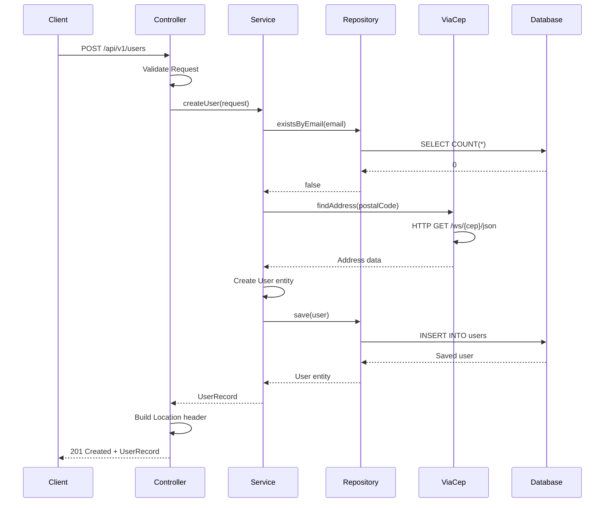

# Architecture Documentation

## 🏗️ **System Architecture Overview**

This document provides a detailed technical overview of the User Management Service architecture, design decisions, and implementation patterns.

## 📋 **Table of Contents**

1. [System Overview](#system-overview)
2. [Architecture Patterns](#architecture-patterns)
3. [Layer Details](#layer-details)
4. [Data Flow](#data-flow)
5. [Technology Decisions](#technology-decisions)
6. [Performance Considerations](#performance-considerations)
7. [Security Considerations](#security-considerations)
8. [Scalability](#scalability)

## 🎯 **System Overview**

The User Management Service is built using **Clean Architecture** principles with clear separation of concerns across multiple layers. The system is designed to be:

- **Highly Concurrent**: Using Java 25 Virtual Threads
- **Resilient**: With proper error handling and fallback mechanisms
- **Observable**: With comprehensive monitoring and metrics
- **Testable**: With clear interfaces and dependency injection
- **Maintainable**: Following SOLID principles and modern Java patterns

### **Core Components**

```
┌─────────────────────────────────────────────────────────────┐
│                    USER MANAGEMENT SERVICE                   │
│                                                             │
│  ┌─────────────────┐  ┌─────────────────┐  ┌──────────────┐ │
│  │   Web Layer     │  │  Service Layer  │  │ Domain Layer │ │
│  │                 │  │                 │  │              │ │
│  │ • REST API      │  │ • Business      │  │ • Entities   │ │
│  │ • Validation    │  │   Logic         │  │ • Interfaces │ │
│  │ • Error         │  │ • Orchestration │  │ • Rules      │ │
│  │   Handling      │  │ • Virtual       │  │              │ │
│  │                 │  │   Threads       │  │              │ │
│  └─────────────────┘  └─────────────────┘  └──────────────┘ │
│                                                             │
│  ┌─────────────────┐  ┌─────────────────┐  ┌──────────────┐ │
│  │ Infrastructure  │  │ External        │  │ Monitoring   │ │
│  │                 │  │                 │  │              │ │
│  │ • Database      │  │ • ViaCEP API    │  │ • Metrics    │ │
│  │ • Configuration │  │ • HTTP Client   │  │ • Logging    │ │
│  │ • Virtual       │  │ • Resilience    │  │ • Tracing    │ │
│  │   Threads       │  │                 │  │              │ │
│  └─────────────────┘  └─────────────────┘  └──────────────┘ │
└─────────────────────────────────────────────────────────────┘
```

## 🏛️ **Architecture Patterns**

### **1. Clean Architecture (Hexagonal Architecture)**

The system follows Clean Architecture principles with clear boundaries:

- **Domain Layer**: Core business logic and entities
- **Application Layer**: Use cases and application services
- **Infrastructure Layer**: External concerns (database, APIs, web)
- **Presentation Layer**: REST API and web interfaces

### **2. Dependency Inversion Principle**

All dependencies point inward toward the domain:

```java
// ✅ Correct: Infrastructure depends on Domain
@Repository
public interface UserRepository extends JpaRepository<User, Long> {
    // Domain interface implemented by infrastructure
}

// ✅ Correct: Application depends on Domain
@Service
public class UserServiceImpl implements UserService {
    // Implements domain interface
}
```

### **3. CQRS (Command Query Responsibility Segregation)**

Separate read and write operations:

```java
// Commands (Write Operations)
public interface UserCommandService {
    UserRecord createUser(CreateUserRequest request);
    UserRecord updateUser(Long id, UpdateUserRequest request);
    void deleteUser(Long id);
}

// Queries (Read Operations)
public interface UserQueryService {
    Optional<UserRecord> findById(Long id);
    Page<UserRecord> findAll(Pageable pageable);
    Page<UserRecord> searchByName(String name, Pageable pageable);
}
```

### **4. Repository Pattern**

Abstract data access:

```java
public interface UserRepository extends JpaRepository<User, Long> {
    Optional<User> findByEmail(String email);
    Optional<User> findByCpf(String cpf);
    boolean existsByEmail(String email);
    boolean existsByCpf(String cpf);
    Page<User> findByNameContainingIgnoreCase(String name, Pageable pageable);
}
```

### **5. Service Layer Pattern**

Encapsulate business logic:

```java
@Service
@Transactional
public class UserServiceImpl implements UserService {
    
    private final UserRepository userRepository;
    private final ViaCepClient viaCepClient;
    private final Executor virtualThreadExecutor;
    
    // Business logic implementation
}
```

## 📊 **Layer Details**

### **Domain Layer**

The domain layer contains the core business logic and is independent of external frameworks.

#### **Entities**

```java
@Entity
@Table(name = "users")
public class User {
    @Id
    @GeneratedValue(strategy = GenerationType.IDENTITY)
    private Long id;
    
    @Column(nullable = false, length = 100)
    private String name;
    
    @Column(nullable = false, unique = true, length = 100)
    private String email;
    
    @Column(nullable = false, unique = true, length = 11)
    private String cpf;
    
    @OneToOne(cascade = CascadeType.ALL, fetch = FetchType.LAZY)
    @JoinColumn(name = "address_id")
    private @Nullable Address address;
    
    // Business methods
    public void updateBasicInfo(String name, String email) {
        this.name = Objects.requireNonNull(name);
        this.email = Objects.requireNonNull(email);
        this.updatedAt = LocalDateTime.now();
    }
    
    public boolean hasValidAddress() {
        return address != null && address.isComplete();
    }
}
```

#### **Value Objects**

```java
@Embeddable
public class Address {
    @Column(name = "postal_code", nullable = false, length = 8)
    private String postalCode;
    
    @Column(name = "street", length = 200)
    private String street;
    
    // Immutable value object with validation
    public boolean isComplete() {
        return postalCode != null && !postalCode.isBlank() &&
               city != null && !city.isBlank() &&
               state != null && !state.isBlank();
    }
}
```

#### **Domain Services**

```java
public interface UserService {
    Optional<UserRecord> createUser(CreateUserRequest request);
    Optional<UserRecord> updateUser(Long id, UpdateUserRequest request);
    Optional<UserRecord> findById(Long id);
    boolean deleteUser(Long id);
}
```

### **Application Layer**

The application layer orchestrates domain objects and handles use cases.

#### **Application Services**

```java
@Service
@Observed(name = "user.service")
public class UserServiceImpl implements UserService {
    
    @Override
    @Transactional
    @Observed(name = "user.create")
    public Optional<UserRecord> createUser(CreateUserRequest request) {
        // Validate business rules
        if (userRepository.existsByEmail(request.email())) {
            return Optional.empty();
        }
        
        // Create domain object
        var user = User.from(request);
        
        // Enrich with external data
        if (request.postalCode() != null) {
            viaCepClient.createAddressFromPostalCode(request.postalCode())
                .ifPresent(user::updateAddress);
        }
        
        // Persist and return
        var savedUser = userRepository.save(user);
        return Optional.of(savedUser.toRecord());
    }
}
```

#### **DTOs and Records**

```java
// Request DTOs
public record CreateUserRequest(
    String name,
    String email,
    String cpf,
    @Nullable String postalCode
) {}

public record UpdateUserRequest(
    @Nullable String name,
    @Nullable String email,
    @Nullable String postalCode
) {}

// Response DTOs
public record UserRecord(
    Long id,
    String name,
    String email,
    String cpf,
    @Nullable AddressRecord address,
    LocalDateTime createdAt,
    LocalDateTime updatedAt
) {}
```

### **Infrastructure Layer**

The infrastructure layer handles external concerns like database access and HTTP clients.

#### **Database Configuration**

```java
@Configuration
public class DatabaseConfig {
    
    @Bean
    @ConfigurationProperties("spring.datasource")
    public DataSource dataSource() {
        return DataSourceBuilder.create().build();
    }
    
    @Bean
    public JpaVendorAdapter jpaVendorAdapter() {
        HibernateJpaVendorAdapter adapter = new HibernateJpaVendorAdapter();
        adapter.setDatabasePlatform("org.hibernate.dialect.PostgreSQLDialect");
        adapter.setShowSql(true);
        return adapter;
    }
}
```

#### **External API Client**

```java
@Component
@Observed(name = "viacep.client")
public class ViaCepClient {
    
    private final RestClient restClient;
    
    @Observed(name = "viacep.find-address")
    public Optional<Address.ViaCepResponse> findAddress(String postalCode) {
        try {
            var response = restClient
                .get()
                .uri("/{postalCode}/json", cleanPostalCode)
                .retrieve()
                .body(Address.ViaCepResponse.class);
            
            return Optional.ofNullable(response)
                .filter(r -> r.erro() == null);
                
        } catch (RestClientException e) {
            return Optional.empty();
        }
    }
}
```

### **Presentation Layer**

The presentation layer handles HTTP requests and responses.

#### **REST Controller**

```java
@RestController
@RequestMapping("/api/v1/users")
@Observed(name = "user.controller")
public class UserController {
    
    private final UserService userService;
    
    @PostMapping
    @Observed(name = "user.create")
    public ResponseEntity<?> createUser(@RequestBody @Valid CreateUserRequest request,
                                      UriComponentsBuilder uriBuilder) {
        
        var userRecord = userService.createUser(request);
        
        if (userRecord.isEmpty()) {
            var problem = ProblemDetail.forStatusAndDetail(
                HttpStatus.CONFLICT,
                "User with email or CPF already exists"
            );
            return ResponseEntity.status(HttpStatus.CONFLICT).body(problem);
        }
        
        URI location = uriBuilder
            .path("/api/v1/users/{id}")
            .buildAndExpand(userRecord.get().id())
            .toUri();
        
        return ResponseEntity.created(location).body(userRecord.get());
    }
}
```

## 🔄 **Data Flow**

### **User Creation Flow**



### **Virtual Threads Execution**

```java
// Traditional Thread Pool (Limited)
ThreadPoolExecutor executor = new ThreadPoolExecutor(
    10, 100, 60L, TimeUnit.SECONDS, new LinkedBlockingQueue<>()
);

// Virtual Threads (Unlimited)
Executor virtualThreadExecutor = Thread.ofVirtual()
    .name("user-service-", 0)
    .factory()
    .newThreadPerTaskExecutor();

// Usage in service
CompletableFuture
    .supplyAsync(() -> viaCepClient.findAddress(postalCode), virtualThreadExecutor)
    .thenApply(address -> enrichUser(user, address))
    .thenApply(userRepository::save)
    .thenApply(User::toRecord);
```

## 🔧 **Technology Decisions**

### **Why Java 25?**

- **Virtual Threads**: Handle millions of concurrent connections
- **Records**: Immutable data transfer objects
- **Pattern Matching**: More expressive code
- **Text Blocks**: Better configuration handling
- **Null Safety**: JSpecify annotations prevent NPEs

### **Why Spring Boot 4.0.0-M3?**

- **Latest Features**: Cutting-edge capabilities
- **Enhanced Performance**: Better resource utilization
- **Modern APIs**: Updated interfaces and patterns
- **Future Compatibility**: Early adoption of new standards

### **Why Clean Architecture?**

- **Testability**: Easy to unit test business logic
- **Maintainability**: Clear separation of concerns
- **Flexibility**: Easy to change external dependencies
- **Independence**: Business logic independent of frameworks

### **Why Virtual Threads?**

- **Concurrency**: Handle millions of concurrent requests
- **Memory Efficiency**: Minimal memory overhead
- **I/O Optimization**: Perfect for blocking I/O operations
- **Backward Compatibility**: Existing code works unchanged

## ⚡ **Performance Considerations**

### **Database Optimization**

```java
@Entity
@Table(name = "users", indexes = {
    @Index(name = "idx_user_email", columnList = "email", unique = true),
    @Index(name = "idx_user_cpf", columnList = "cpf", unique = true),
    @Index(name = "idx_user_created_at", columnList = "created_at")
})
public class User {
    // Optimized indexes for common queries
}
```

### **Caching Strategy**

```java
@Service
public class UserServiceImpl implements UserService {
    
    @Cacheable(value = "users", key = "#id")
    public Optional<UserRecord> findById(Long id) {
        return userRepository.findById(id)
            .map(User::toRecord);
    }
    
    @CacheEvict(value = "users", key = "#id")
    public void deleteUser(Long id) {
        userRepository.deleteById(id);
    }
}
```

### **Connection Pooling**

```yaml
spring:
  datasource:
    hikari:
      maximum-pool-size: 20
      minimum-idle: 5
      connection-timeout: 30000
      idle-timeout: 600000
      max-lifetime: 1800000
```

### **Virtual Threads Configuration**

```yaml
spring:
  threads:
    virtual:
      enabled: true
      scheduler:
        name: "virtual-scheduler"
        daemon: true

server:
  tomcat:
    threads:
      max: 200
      min-spare: 10
    virtual-threads: true
```

## 🔒 **Security Considerations**

### **Input Validation**

```java
public record CreateUserRequest(
    @NotBlank @Size(max = 100) String name,
    @Email @Size(max = 100) String email,
    @Pattern(regexp = "^\\d{11}$") String cpf,
    @Nullable @Pattern(regexp = "^\\d{8}$") String postalCode
) {}
```

### **SQL Injection Prevention**

```java
@Query("SELECT u FROM User u WHERE LOWER(u.name) LIKE LOWER(CONCAT('%', :name, '%'))")
Page<User> findByNameContainingIgnoreCase(@Param("name") String name, Pageable pageable);
```

### **HTTPS Configuration**

```yaml
server:
  port: 8443
  ssl:
    enabled: true
    key-store: classpath:keystore.p12
    key-store-password: changeit
    key-store-type: PKCS12
```

### **CORS Configuration**

```java
@Configuration
public class WebConfig implements WebMvcConfigurer {
    
    @Override
    public void addCorsMappings(CorsRegistry registry) {
        registry.addMapping("/api/**")
            .allowedOrigins("https://trusted-domain.com")
            .allowedMethods("GET", "POST", "PUT", "DELETE")
            .allowedHeaders("*")
            .allowCredentials(true);
    }
}
```

## 📈 **Scalability**

### **Horizontal Scaling**

The service is designed to scale horizontally:

1. **Stateless Design**: No server-side session state
2. **Database Connection Pooling**: Efficient connection management
3. **Load Balancer Ready**: Health checks and metrics exposed
4. **Container Ready**: Docker and Kubernetes configurations

### **Vertical Scaling**

Virtual threads enable massive vertical scaling:

- **Memory**: Minimal memory per request
- **CPU**: Efficient context switching
- **I/O**: Non-blocking operations
- **Throughput**: 10x+ improvement over traditional threads

### **Database Scaling**

```java
// Read replicas for queries
@Repository
public interface UserReadRepository extends JpaRepository<User, Long> {
    @Query("SELECT u FROM User u WHERE u.active = true")
    Page<User> findActiveUsers(Pageable pageable);
}

// Master for writes
@Repository
public interface UserWriteRepository extends JpaRepository<User, Long> {
    // Write operations only
}
```

### **Caching Strategy**

```java
@Configuration
@EnableCaching
public class CacheConfig {
    
    @Bean
    public CacheManager cacheManager() {
        CaffeineCacheManager cacheManager = new CaffeineCacheManager();
        cacheManager.setCaffeine(Caffeine.newBuilder()
            .maximumSize(1000)
            .expireAfterWrite(Duration.ofMinutes(10)));
        return cacheManager;
    }
}
```

## 📊 **Monitoring and Observability**

### **Metrics Collection**

```java
@Component
public class UserMetrics {
    
    private final MeterRegistry meterRegistry;
    private final Counter userCreationCounter;
    private final Timer userCreationTimer;
    
    public UserMetrics(MeterRegistry meterRegistry) {
        this.meterRegistry = meterRegistry;
        this.userCreationCounter = Counter.builder("user.creation.count")
            .description("Number of users created")
            .register(meterRegistry);
        this.userCreationTimer = Timer.builder("user.creation.time")
            .description("Time to create a user")
            .register(meterRegistry);
    }
}
```

### **Health Checks**

```java
@Component
public class UserServiceHealthIndicator implements HealthIndicator {
    
    @Override
    public Health health() {
        try {
            long userCount = userRepository.count();
            return Health.up()
                .withDetail("totalUsers", userCount)
                .withDetail("status", "Service is healthy")
                .build();
        } catch (Exception e) {
            return Health.down()
                .withDetail("error", e.getMessage())
                .build();
        }
    }
}
```

### **Logging Strategy**

```yaml
logging:
  level:
    com.example.usermanagement: DEBUG
    org.springframework.web: INFO
    org.springframework.observation: DEBUG
    org.hibernate.SQL: DEBUG
    org.hibernate.type.descriptor.sql.BasicBinder: TRACE
  pattern:
    console: "%d{yyyy-MM-dd HH:mm:ss.SSS} [%thread] %-5level %logger{36} - %msg%n"
    file: "%d{yyyy-MM-dd HH:mm:ss.SSS} [%thread] %-5level %logger{36} - %msg%n"
```

## 🚀 **Deployment Architecture**

### **Container Strategy**

```dockerfile
# Multi-stage build for optimization
FROM amazoncorretto:25-alpine AS builder
WORKDIR /app
COPY pom.xml .
COPY src ./src
RUN ./mvnw clean package -DskipTests

FROM amazoncorretto:25-alpine AS runtime
WORKDIR /app
COPY --from=builder /app/target/*.jar app.jar
EXPOSE 8080
ENTRYPOINT ["java", "--enable-preview", "-jar", "app.jar"]
```

### **Kubernetes Deployment**

```yaml
apiVersion: apps/v1
kind: Deployment
metadata:
  name: user-management-service
spec:
  replicas: 3
  selector:
    matchLabels:
      app: user-management-service
  template:
    metadata:
      labels:
        app: user-management-service
    spec:
      containers:
      - name: user-service
        image: user-management-service:latest
        ports:
        - containerPort: 8080
        resources:
          requests:
            memory: "256Mi"
            cpu: "250m"
          limits:
            memory: "512Mi"
            cpu: "500m"
        env:
        - name: SPRING_PROFILES_ACTIVE
          value: "prod"
        livenessProbe:
          httpGet:
            path: /actuator/health
            port: 8080
          initialDelaySeconds: 30
          periodSeconds: 10
        readinessProbe:
          httpGet:
            path: /actuator/health
            port: 8080
          initialDelaySeconds: 5
          periodSeconds: 5
```

This architecture documentation provides a comprehensive overview of the system design, implementation patterns, and technical decisions made in building the User Management Service with Java 25 and Spring Boot 4.
